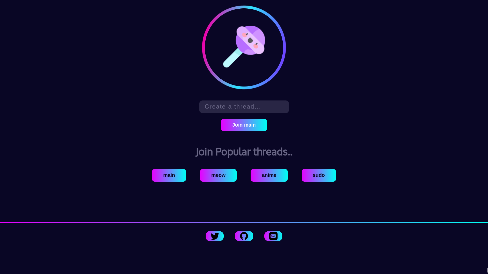

<a href="https://webpai.vercel.app/"><h1>Webpai</h1></a>

Webpai is a decentralized image-board website hosted on the <a href="https://polygon.technology/">Polygon-Network.</a>

## Features
* file sharing(ipfs)
* custom threads
* embed support

smart-contract repo: [webpai-smart-contract](https://github.com/hxyro/webpai-smart-contract)
